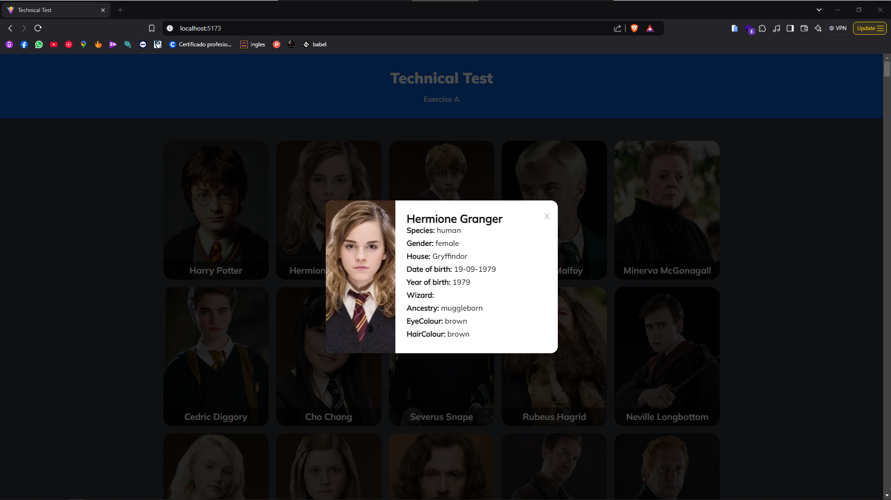

# Harry Potter Characters Project

This project showcases various characters from the Harry Potter franchise following these criteria:

1. Query the API and display all returned elements.
2. Add a generic image to the elements that do not have one.
3. When clicking on a card, the character's information will be displayed.

## Screenshots

### Main Screen


### Character Information


## Installation
1. Clone this repository:  
   ```bash
   git clone https://github.com/your_user/harry-potter-characters.git
   ```
2. Navigate to the project directory:  
   ```bash
   cd harry-potter-characters
   ```
3. Install the necessary dependencies:  
   ```bash
   npm install
   ```
4. Start the server:  
   ```bash
   npm run start
   ```

## Usage
1. Open your browser and go to `http://localhost:3000`.
2. Browse through the characters and click on any card to see more information.

## API
This project uses the following API to fetch character information:
- [Harry Potter API](https://hp-api.onrender.com/)

## Contributions
Contributions are welcome! If you'd like to improve this project, fork it, create a branch, and submit a pull request.